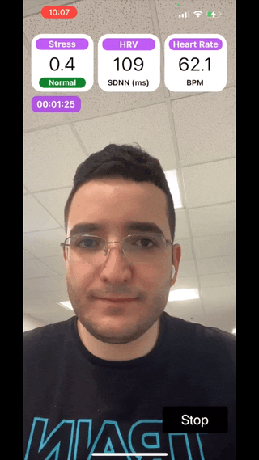
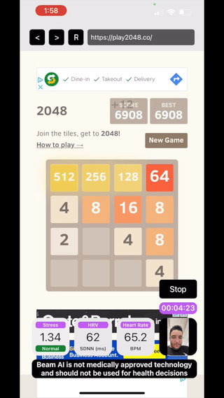

# Beam AI SDK (iOS)

> **Note** 
> **You will need a beamID to use the Beam AI SDK (iOS). You can get your beamID at [dashboard.beamhealth.ai](https://dashboard.beamhealth.ai) :sunglasses:.**

[](https://paperswithcode.com/sota/photoplethysmography-ppg-heart-rate-1?p=real-time-monitoring-of-user-stress-heart)
[](https://paperswithcode.com/sota/photoplethysmography-ppg-heart-rate-2?p=real-time-monitoring-of-user-stress-heart)

Beam AI SDK (iOS) enables iOS apps to monitor the user's heart rate, heart rate variability and stress through the selfie-camera. Our technology extracts the user’s pulse wave by analyzing subtle color variations across the skin regions of the user’s face. The user’s pulse is then used to determine stress, heart rate, and heart rate variability. To determine stress, we analyze the variability of the user's heartbeats according to the Baevsky Stress Index which has been shown to provide an accurate quantitative measure of physiological stress.

By using Beam AI SDK (iOS) and any accompanying documentation and tools, you declare that you have read, understood, and agreed to our [SDK Licence Agreement](https://www.beamhealth.ai/sdk-licence-agreement.html), [Terms of Service](https://www.beamhealth.ai/terms-of-service.html) and [Privacy Policy](https://www.beamhealth.ai/privacy-policy.html).



## Start Using Beam AI SDK (in less than 15 minutes)

First, please add the Beam AI SDK swift package from the ```modular``` branch (from this repository) to your Xcode project. Simply click File > Add Packages. Then, look up [https://github.com/beamai/BeamAISDK-iOS/](https://github.com/beamai/BeamAISDK-iOS/), select dependency rule to be branch, type in ```modular``` and then click + to add the Beam AI SDK package to your project.

Then, install the dependency ```pod 'GoogleToolboxForMac'``` with cocopods. Note that this build require a cocopod set up, xcworkspace, and installation of ```GoogleToolboxForMac``` as a dependency. For a standalone build of the Beam AI SDK (iOS), please visit the main branch of this repository.

You can initialize an instance of the SDK as noted below.

```
import Beam AI SDK

let beamAI = try! BeamAI(beamID: "your-20-char-beamID", frameRate: 30, window: 60.0, updateEvery: 1.0)
```

Simply specify the frame rate (one of 30, 60 or 120 frames per second), time window over which you would like measurements to be estimated from (min 10s) and how frequently the values should be updated (min 1s), and provide your beamID for validating the SDK. Both window and updateEvery are in seconds. Note that the initializer throws a RuntimeError if invalid configurations are requested for frameRate, window and updateEvery arguments.

Then call ```startSession()``` to operationalize the Beam AI SDK object. This turns on the camera, and is required before you start monitoring.

```
beamAI?.startSession()
```

Now, we're ready to start monitoring user stress, heart rate and heart rate variability. Call ```startMonitoring()``` to begin monitoring.

```
try! self.beamAI?.startMonitoring()
```

Note that ```startMonitoring()``` can throw a RuntimeError if 1) the SDK could not be validated properly or 2) you haven't started the camera session by calling ```startSession()```. SDK validation can fail if an invalid beamID is used or if no internet accesss is available to validate the beamID. Currently, you will unfortunately need internet access for validation of the SDK. Once validated, everything else happens on device and internet access is not required. Each validated SDK instance is valid for 24hr and the SDK will automatically revalidate after 24hr.

The SDK instance can also be manually validated using the ```validateSDK()``` method in case the initial validation request. You can check to see if the SDK has been successfully validated by calling ```isValidated()```. Note that it can take several seconds for SDK validation to complete.

Now that monitoring has started, you can query values for stress, HRV and pulse by calling ```getEstimates()```.

```
let output = self.beamAI?.getEstimates()
```

The output is a dictionary containing ```STRESS```, heart rate variability (```HRV```) and heart rate (```HEARTRATE```) values, number of frames processed (```FRAMES```), and message code (```CODE```) + description specifying the state of monitoring (```DESC```). The returned query would be one of the following 5 monitoring and 2 error states.

```        
MONITORING STATE #1: Beam AI SDK is currently not monitoring. Call startMonitoring() to begin session.
["CODE": "S1-SDKIsNotMonitoring",
  "DESC": "Beam AI SDK is currently not monitoring. Please call startMonitoring() to start processing video input.",
  "STRESS": -1.0,
  "HEARTRATE": -1.0,
  "HRV": -1.0,
  "FRAMES": 0]
```

```
MONITORING STATE #2: Beam AI SDK is monitoring but no face is present in the camera's field of view.
["CODE": "S2-NoFaceDetected",
  "DESC": "Beam AI SDK is monitoring but no face is currently detected in field of view.",
  "STRESS": -1.0,
  "HEARTRATE": -1.0,
  "HRV": -1.0,
  "FRAMES": 0]
``` 

``` 
MONITORING STATE #3: Monitoing is happening but the minimum number of frames to produce stress, pulse and HRV estimates has not been reached.
["CODE": "S3-NotEnoughFramesProcessed",
  "DESC": "Beam AI SDK has not processed enough frames to produce stress, heart rate and HRV estimates. Minimum of MIN_FRAMES_REQUIRED frames required. Currently at NUMBER_OF_FRAMES frames.",
  "STRESS": -1.0,
  "HEARTRATE": -1.0,
  "HRV": -1.0,
  "FRAMES": NUMBER_OF_FRAMES]
```

```
MONITORING STATE #4: With as little as 10s, Beam AI will provide values but these would be based on windows that could be smaller than that's been specified.
["CODE": "S4-NotFullWindow",
  "DESC": "Beam AI SDK has enough frames to produce stress, heart rate and HRV estimates. However, not enough frames have been processed for a full window of SPECIFIED_TIME_WINDOW seconds. The estimates are based on the SHORTER_TIME_WINDOW seconds currently recorded.",
  "STRESS": STRESS_VAL,
  "HEARTRATE": HEART_RATE_VAL,
  "HRV": HRV_VAL,
  "FRAMES": NUMBER_OF_FRAMES]
```

```
MONITORING STATE #5: Estimates of stress, HRV and pulse based on full window of time specified.
["CODE": "S5-FullResults",
  "DESC": "Beam AI SDK has produced stress, heart rate, and HRV estimates based on the user's pulse wave over the past SPECIFIED_TIME_WINDOW seconds.",
  "STRESS": STRESS_VAL,
  "HEARTRATE": HEART_RATE_VAL,
  "HRV": HRV_VAL,
  "FRAMES": NUMBER_OF_FRAMES]
``` 

```
ERROR STATE #1: SDK validation has failed. Monitoring will be stopped!
["CODE": "E1-SDKValidationRejected",
  "DESC": "Beam AI SDK validation was not successful. Monitoring has been paused. Please check your internet connection and make sure your beamID is valid. Re-initialize the SDK or call validate() to revalidate your key.",
  "STRESS": -1.0,
  "HEARTRATE": -1.0,
  "HRV": -1.0,
  "FRAMES": 0]
```

```
ERROR STATE #2: SDK validation has failed. Monitoring will be stopped!
["CODE": "E2-CameraSessionNotRunning",
  "DESC": "The camera is not on. Please call startSession() to turn on the camera, and then call startMonitoring() to start monitoring user stress, heart rate and HRV.",
  "STRESS": -1.0,
  "HEARTRATE": -1.0,
  "HRV": -1.0,
  "FRAMES": 0]
```

To stop monitoring, call the ```stopMonitoring()``` function.

```
beamAI?.stop()
```

To stop running the camera, call the ```stopSession()``` function. Note that if there is the SDK is monitoring when you call ```stopSession()```, the SDK will automatically stop monitoring before shutting down the camera session.

```
beamAI?.stopSession()
```

## Sample Projects

**Beam AI Lite ([App Store](https://apps.apple.com/ca/app/beam-ai-lite/id1629758948), [GitHub](https://github.com/beamai/BeamAILite-iOS))** demonstrates how you can build a simple app to monitor stress, heart rate and heart rate variability using the Beam AI SDK (iOS). 

**Beam AI Browser ([App Store](https://apps.apple.com/ca/app/beam-ai-browser/id1629793784), [GitHub](https://github.com/beamai/BeamAIBrowser-iOS))** demonstrates how the user can browse the web while the app monitors user stress, heart rate and heart rate variability using the Beam AI SDK (iOS).

If this is your first time using the Beam AI SDK (iOS), we strongly recommend loading up one of these projects to start playing with the SDK.

## Frequently Asked Questions

**How accurate is the technology behind the Beam AI SDK?**

You can find our validation study [here](https://arxiv.org/pdf/2210.01791.pdf). We evaluate our technology on the UBFC dataset, the MMSE-HR dataset, and Beam AI's internal data. Our technology achieves 99.2%, 97.8% and 98.5% accuracy for heart rate estimation on each benchmark respectively, a nearly twice better error rate than competing methods. We further demonstrate an average Pearson correlation of 0.801 in determining stress and heart rate variability, thus producing commercially useful readings to derive content decisions in apps.

**What data is collected?**

Please refer to our [Privacy Policy](https://www.beamhealth.ai/privacy-policy.html). We place user privacy as our number #1 priority. No face data, health data, or video data ever leaves the phone and everything is processed on device. We do collect usage statistics and device, app bundle, and IP information when validating usage of the SDK.

**What happens if multiple faces are present?**

At the moment, we cannot track faces and/or perform multi-person monitoring. Therefore, in any frame, the face with the largest pixel area in the frame is processed. We are working towards resolving this issue by incorporating face indentification and multi-face tracking in the SDK. Please open an issue if you would like to see this happen sooner!

**How quickly does Beam AI reconnect if the face leaves field of view?**

Immediately! As soon as the face appears again in the frame, we will start monitoring. That said, when there is no face present, we reset monitoring and therefore, you will need to wait the standard 10s when the face re-appears to get the stress, HRV and pulse estimates.

**How do I know when face/signal is lost and regained?**

Output states returned from the getEstimates() method specifies the state of the face and the signal should it be lost and regained.

**What happens if the requested frame rate is one of 30, 60, or 120 but not available on the device?**

When requesting frame rate, we configure HD selfie video session at the requested frame rate. If it is not available, the SDK defaults to the default selfie-camera setting, and the internal modules are reconfigured to use the default selfie-camera setting.

**Can I test on a simulator?**

The SDK works only on iPhone and iPad devices. Note that Xcode simulators do not support camera access. For applications using the camera, including the Beam AI SDK (iOS), you will need to run your app on a physical device. We will be expanding support for macOS in the future.

**Do you have an Android SDK?**

We are working on an Android SDK to enable monitoring of the user's heart rate, heart rate variability and stress through the selfie-camera in Android apps. We are targeting release in mid Oct 2022. Follow [https://github.com/beamai/BeamAISDK-Android](https://github.com/beamai/BeamAISDK-Android) to be notified of our Android release.

**How much does the Beam AI SDK cost?**
Please see our [SDK Pricing](https://www.beamhealth.ai/index.html#site-pricing) for more details.

## SDK Licence Agreement & Privacy Policy

By using Beam AI SDK (iOS) and any accompanying documentation and tools, you declare that you have read, understood, and agreed to our [SDK Licence Agreement](https://www.beamhealth.ai/sdk-licence-agreement.html), [Terms of Service](https://www.beamhealth.ai/terms-of-service.html) and [Privacy Policy](https://www.beamhealth.ai/privacy-policy.html). Furthermore, as the Beam AI SDK is partly built using Google's ARCore Augmented Faces library, you are agreeing to their license agreement and privacy policy as outlined at [https://github.com/google-ar/arcore-ios-sdk](https://github.com/google-ar/arcore-ios-sdk).

## Contact

For feature requests, questions and support, please open a GitHub issue. For all other inquiries, please email us directly at [contact@beamhealth.ai](contact@beamhealth.ai)!

Follow us on [LinkedIn](https://www.linkedin.com/company/beamhealthai/), [Instagram](https://www.instagram.com/beamhealthai/), [Twitter](https://twitter.com/BeamHealthAI) and [YouTube](https://www.youtube.com/channel/UCLhM9USQWe01OZoPOFvQ6sg/featured) to stay up-to-date with our latest news, updates and releases - and lots of fun demos and posts!
